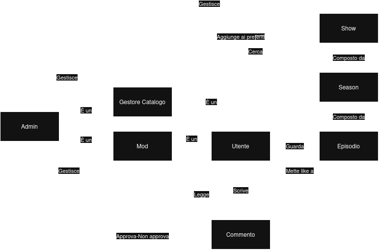

# Proposta Progetto `NexuStream`

## Chi siamo?
- Davide Alaimo
- Claudio Luparello
- Christian Manto

## Cosa facciamo?
La nostra proposta è quella di realizzare un sito di streaming anime con un focus particolare all'aspetto di discussione.

## Quali sono gli attori dell'applicazione?

| Attore | Ruolo |
|---|---|
| Utente | Crea e gestisce profilo, visualizza contenuti streaming e discussioni, interagisce in sezione commenti, cerca show. |
| Moderatore | Gestisce l'interazione tra gli utenti. Per gravi condotte può impedire all'utente di commentare. |
| Gestore Catalogo | Mantiene aggiornato il catalogo degli show. |
| Admin | Visualizza lista moderatori e gestori catalogo, e gestisce i loro ruoli. Condivide tutti i loro permessi. |
---
## Quali sono le relazioni tra i nostri attori?

