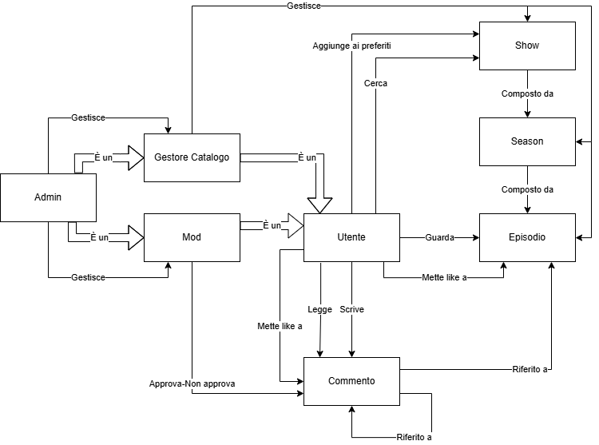

# Proposta Progetto `NexuStream`

## Chi siamo?

- Davide Alaimo
- Claudio Luparello
- Christian Manto

## Cosa facciamo?

La nostra proposta è quella di realizzare un sito di streaming anime con un focus particolare sull'aspetto di discussione. Il nome del sito è ispirato proprio da questa filosofia: Nexus, un luogo centrale dove riunirsi.

Il sito è pensato per stimolare la discussione sugli episodi degli anime appena rilasciati: i commenti verranno aperti non appena l'episodio sarà disponibile per la visione, mentre dopo 2 settimane dall'uscita dell'episodio non sarà più possibile per gli utenti partecipare alla discussione. Questa scelta si adatta allo standard dell'industria che prevede solitamente il rilascio di episodi a cadenza settimanale fino al termine di una stagione. Inoltre è volta a permettere anche un'adeguata moderazione delle discussioni per il periodo in cui sono attive.

Nonostante ciò, prevediamo che una buona parte degli utenti potrebbe voler guardare le stagioni nella loro interezza al termine delle stesse. Per non precludere loro la possibilità di partecipare alla discussione, i commenti saranno riaperti al termine di una stagione, per un determinato periodo di tempo.

Il nostro obiettivo è quindi fare in modo di invogliare gli utenti a manifestare le proprie opinioni reali e "a caldo" su ciascuna serie, lasciando comunque una certa libertà sui tempi di visione.

Per casi particolari, si può prevedere in futuro il blocco o sblocco manuale delle discussioni da parte di utenti autorizzati.

Ogni episodio avrà una sezione commenti ad esso dedicata: i commenti supporteranno i timestamp del video, e **diversi** *stili* di **_formattazione_**. I commenti verranno gestiti come thread: sarà possibile quindi commentare l'episodio stesso o rispondere ad un commento particolare. L'intera thread farà sempre riferimento all'episodio.

## Quali sono gli attori dell'applicazione?

| Attore | Ruolo |
|---|---|
| Utente | L'Utente crea e gestisce il proprio profilo, visualizza contenuti e interagisce con le discussioni.   Sono disponibili funzionalità di registrazione, di login, di recupero e di modifica password. L'Utente può partecipare alle discussioni nelle rispettive sezioni commenti. Può cercare show specifici in base al titolo o genere, mettere like a commenti ed episodi e di inserire le serie nei propri preferiti, con appositi pulsanti.   L'Utente può interrompere la visione dei contenuti in ogni momento, e riprendere facilmente la visione attraverso la funzionalità di "Continua a guardare".   Può scegliere una foto di profilo tra opzioni predeterminate, un username e una lingua preferita. Questa influenzerà la lingua predefinita per i contenuti, se disponibile.   L'Utente ha i privilegi più bassi di tutta l'applicazione, dopo il Guest. |
| Moderatore | Il Moderatore gestisce l'interazione tra gli utenti, specificamente nelle sezioni commenti.   Qualora un utente infranga i ToS della piattaforma, il Moderatore ha il diritto (e il dovere) di impedirgli di commentare, e di nascondere commenti offensivi. Qualora lasci un commento sotto qualche episodio, avrà un flair speciale accanto allo username. Può visualizzare tutti i commenti, compresi quelli nascosti.   Sono disponibili funzionalità per facilitare l'operazione di moderazione, per esempio quella di contrassegnare i commenti già approvati. Svolgerà le sue funzioni all'interno della sezione commenti stessa, con un interfaccia modificata appositamente. |
| Gestore Catalogo | Il Gestore Catalogo mantiene aggiornato il catalogo delle serie.   Per svolgere le sue funzioni avrà accesso a schermate particolari, contenenti per esempio form per l'inserimento di nuovi contenuti. Può aggiungere, modificare, rimuovere episodi, stagioni e serie, nonché rispettive descrizioni. Può aggiungere lingue e sottotitoli ad episodi. Ha anche il compito di aggiornare il catalogo delle foto profilo. Come il Moderatore, anche il Gestore Catalogo ha un flair speciale. |
| Admin | L'Admin si occupa di supervisionare Moderatori e Gestori Catalogo, che sono selezionati da lui personalmente. Può visualizzare e modificare lo status di ciascun utente a suo piacimento, avendo i privilegi più alti. Condivide le funzionalità di Moderatore e Gestore Catalogo. Inoltre, ha il flair più speciale di tutti. |
| Guest | Può visualizzare tutte le pagine che non richiedono alcuna autorizzazione, come la lista degli episodi di uno show. Non può visualizzare contenuti streaming, personalizzare il profilo, o visualizzare o pubblicare commenti. |
---

## Quali sono le entità principali?

| Entità | Descrizione |
|---|---|
| Show | Ha un titolo, una descrizione, un thumbnail, e diverse stagioni. Ha una data di inizio e di fine. Può avere uno o più generi. Può essere aggiunto ai preferiti. |
| Stagione | Ha un titolo, una descrizione, data di inizio e di fine. Contiene più episodi.  |
| Episodio | Ha un titolo, una descrizione, e data di uscita. Può essere visualizzato in più lingue e con più sottotitoli, se presenti. L'utente può mettere like a un episodio. Viene mantenuta la cronologia di visione. |
| Commento | Ha un autore e una data di scrittura. Può essere riferito a un commento genitore, creando così un thread. Ogni thread fa riferimento a uno specifico episodio. Può contenere timestamp dell'episodio, testo formattato, e tag spoiler. Il moderatore ne gestisce la visibilà e l'approvazione. |
---

 

## Quali sono le relazioni tra i nostri attori?

Di seguito, un diagramma ER che mostra le relazioni basilari presenti nel sito, in concordanza con quanto descritto sopra:

